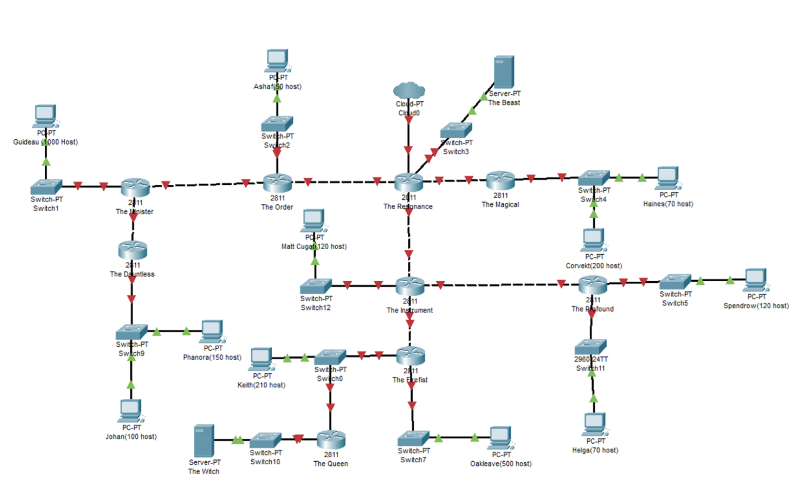
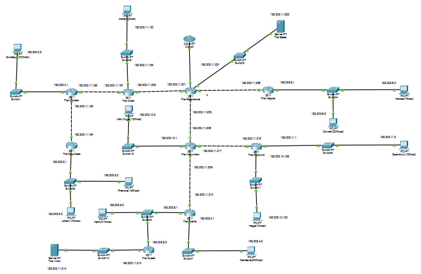
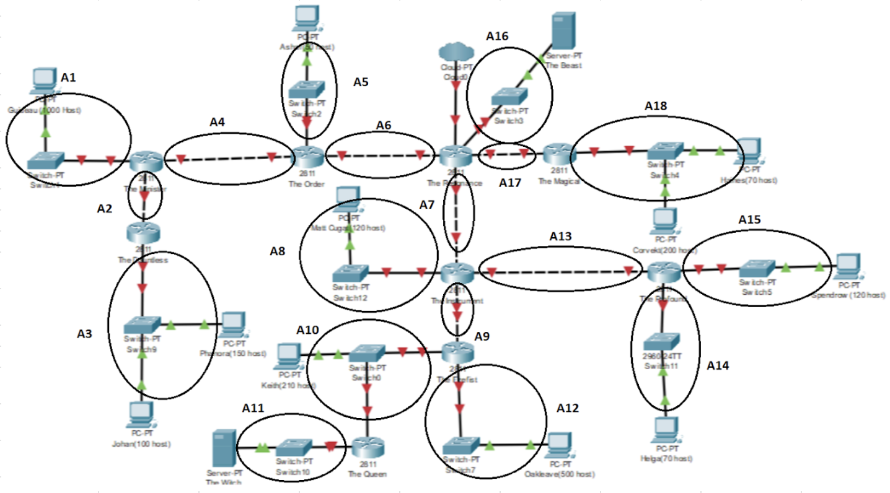
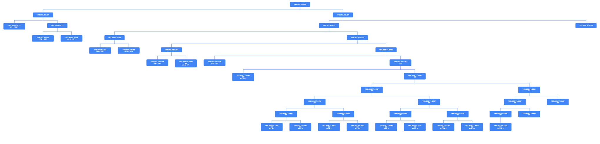

# Jarkom-Modul-4-F06-2022

## Kelompok F06

|               Nama               |      NRP      |
| -------------------------------- | ------------- |
| Benedictus Bimo Cahyo Wicaksono  |  5025201097   |  
| Andhika Ditya Bagaskara D.       |  5025201096   |
| Theresia Nawangsih               |  5025201144   |

# Topologi Soal

  

 

## Catatan Soal
- Soal shift dikerjakan pada Cisco Packet Tracer dan GNS3 menggunakan metode perhitungan CLASSLESS yang berbeda.
`Keterangan: Bila di CPT menggunakan VLSM, maka di GNS3 menggunakan CIDR atau Sebaliknya`
- Pembagian IP menggunakan Prefix IP yang telah ditentukan pada modul pengenalan
` F06 = 192.202`

# Cisco Packet Tracer menggunakan VLSM
- Pertama membuat topologi pada CPT, sesuai dengan yang diminta soal
 

  

 

- Kedua dapat mebuat label pada topologi 
 

  

 
Pada pembagian ini, terdapat 18 subnet dimulai dari A1-A18. Selanjutnya, kita dapat melakukan pembagian seperti tabel dibawah ini
 

| Simbol   |  Jumlah IP |  Length |  Subnet Mask  | 
| -----------| -----------| --------|---------------|
|     A1     |    1001    |   /22   | 255.255.252.0 |   
|     A2     |     2      |   /30   | 255.255.255.252 | 
|     A3     |     251    |   /24   | 255.255.252.0 | 
|     A4     |     2      |   /30   | 255.255.255.252 | 
|     A5     |     51     |   /26   | 255.255.255.192 | 
|     A6     |     2      |   /30   | 255.255.255.252 | 
|     A7     |     2      |   /30   | 255.255.255.252 | 
|     A8     |     121    |   /25   | 255.255.255.128 | 
|     A9     |     2      |   /30   | 255.255.255.252 | 
|    A10     |     211    |   /24   | 255.255.252.0 | 
|    A11     |     2      |   /30   | 255.255.255.252 | 
|    A12     |     501    |   /23   | 255.255.254.0 | 
|    A13     |     2      |   /30   | 255.255.255.252 | 
|    A14     |     71     |   /25   | 255.255.255.128 | 
|    A15     |     421    |   /25   | 255.255.255.128 | 
|    A16     |     2      |   /30   | 255.255.255.252 | 
|    A17     |     2      |   /30   | 255.255.255.252 | 
|    A18     |     271    |   /23   | 255.255.254.0  |  

Berdasarkan total IP dan netmask yang dibutuhkan, maka kita dapat menggunakan netmask /20 untuk memberikan pengalamatan IP pada subnet.

- Ketiga, kita dapat mengitung pembagian IP dengan membuat tree. lalu, memilih subnet besar yaitu 192.202.0.0 dengan netmask /20. 
 

  

 
Untuk pembagian nya dimulai dari 192.202.0.0/20 hingga 192.202.11.224/30

- Keempat, setelah membuat tree, kita dapat melanjutkan dengan pembagian IP untuk Network ID dan Broadcast Address

|    Simbol   |  Network ID  | Broadcast Address | 
| ------------| -------------|-------------------|
|     A1      |    1001      |   192.202.3.255   |
|     A2      |     2        |   192.202.11.195  | 
|     A3      |     251      |   192.202.8.255   |
|     A4      |     2        |   192.202.11.199  | 
|     A5      |     51       |   192.202.11.191  |  
|     A6      |     2        |   192.202.11.203  |
|     A7      |     2        |   192.202.11.207  | 
|     A8      |     121      |   192.202.10.124  | 
|     A9      |     2        |   192.202.11.211  |  
|    A10      |     211      |   192.202.9.255   |  
|    A11      |     2        |   192.202.11.215  |   
|    A12      |     501      |   192.202.5.255   |   
|    A13      |     2        |   192.202.11.219  |  
|    A14      |     71       |   192.202.10.255  |   
|    A15      |     421      |   192.202.11.127  |   
|    A16      |     2        |   192..202.11.223 |   
|    A17      |     2        |   192.202.11.227  |   
|    A18      |     271      |   192.202.7.255   |   

## Testing