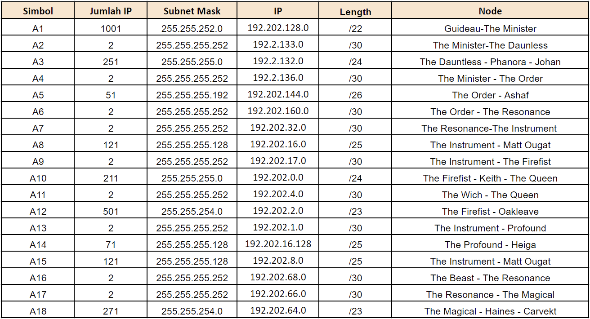

# Jarkom-Modul-4-F06-2022

## Kelompok F06

|               Nama               |      NRP      |
| -------------------------------- | ------------- |
| Benedictus Bimo Cahyo Wicaksono  |  5025201097   |  
| Andhika Ditya Bagaskara D.       |  5025201096   |
| Theresia Nawangsih               |  5025201144   |

# Topologi Soal

  

 

## Catatan Soal
- Soal shift dikerjakan pada Cisco Packet Tracer dan GNS3 menggunakan metode perhitungan CLASSLESS yang berbeda.
`Keterangan: Bila di CPT menggunakan VLSM, maka di GNS3 menggunakan CIDR atau Sebaliknya`
- Pembagian IP menggunakan Prefix IP yang telah ditentukan pada modul pengenalan
` F06 = 192.202`

# Cisco Packet Tracer menggunakan VLSM
- Pertama membuat topologi pada CPT, sesuai dengan yang diminta soal
 

  

 

- Kedua dapat mebuat label pada topologi 
 

  

 
Pada pembagian ini, terdapat 18 subnet dimulai dari A1-A18. Selanjutnya, kita dapat melakukan pembagian seperti tabel dibawah ini
 

| Simbol   |  Jumlah IP |  Length |  Subnet Mask  | 
| -----------| -----------| --------|---------------|
|     A1     |    1001    |   /22   | 255.255.252.0 |   
|     A2     |     2      |   /30   | 255.255.255.252 | 
|     A3     |     251    |   /24   | 255.255.252.0 | 
|     A4     |     2      |   /30   | 255.255.255.252 | 
|     A5     |     51     |   /26   | 255.255.255.192 | 
|     A6     |     2      |   /30   | 255.255.255.252 | 
|     A7     |     2      |   /30   | 255.255.255.252 | 
|     A8     |     121    |   /25   | 255.255.255.128 | 
|     A9     |     2      |   /30   | 255.255.255.252 | 
|    A10     |     211    |   /24   | 255.255.252.0 | 
|    A11     |     2      |   /30   | 255.255.255.252 | 
|    A12     |     501    |   /23   | 255.255.254.0 | 
|    A13     |     2      |   /30   | 255.255.255.252 | 
|    A14     |     71     |   /25   | 255.255.255.128 | 
|    A15     |     421    |   /25   | 255.255.255.128 | 
|    A16     |     2      |   /30   | 255.255.255.252 | 
|    A17     |     2      |   /30   | 255.255.255.252 | 
|    A18     |     271    |   /23   | 255.255.254.0  |  

Berdasarkan total IP dan netmask yang dibutuhkan, maka kita dapat menggunakan netmask /20 untuk memberikan pengalamatan IP pada subnet.

- Ketiga, kita dapat mengitung pembagian IP dengan membuat tree. lalu, memilih subnet besar yaitu 192.202.0.0 dengan netmask /20. 
 

  

 
Untuk pembagian nya dimulai dari 192.202.0.0/20 hingga 192.202.11.224/30

- Keempat, setelah membuat tree, kita dapat melanjutkan dengan pembagian IP untuk Network ID dan Broadcast Address

|    Simbol   |  Network ID  | Broadcast Address | 
| ------------| -------------|-------------------|
|     A1      |    1001      |   192.202.3.255   |
|     A2      |     2        |   192.202.11.195  | 
|     A3      |     251      |   192.202.8.255   |
|     A4      |     2        |   192.202.11.199  | 
|     A5      |     51       |   192.202.11.191  |  
|     A6      |     2        |   192.202.11.203  |
|     A7      |     2        |   192.202.11.207  | 
|     A8      |     121      |   192.202.10.124  | 
|     A9      |     2        |   192.202.11.211  |  
|    A10      |     211      |   192.202.9.255   |  
|    A11      |     2        |   192.202.11.215  |   
|    A12      |     501      |   192.202.5.255   |   
|    A13      |     2        |   192.202.11.219  |  
|    A14      |     71       |   192.202.10.255  |   
|    A15      |     421      |   192.202.11.127  |   
|    A16      |     2        |   192..202.11.223 |   
|    A17      |     2        |   192.202.11.227  |   
|    A18      |     271      |   192.202.7.255   |   

## Testing
Daunless ke Profound
 

 

Guideau ke Firefist
 

 

The Witch ke the Order
 

 

Helga ke Phanora
 

 

The Beast ke The Instrument
 

 

The Witch ke The Beast
 

 

Matt Ougat ke Corvekt
 

 

The Beast ke Spendrow
 

 

Haines ke Keith
 

 

Johan ke The Queen
 

 

Oakleave ke The Witch
 

 

Ashaf ke the Resonance
 

 

Corvekt ke The Minister
 

 

Guideau ke Helga
 

 

Ashaf ke The Queen
 

 

# GNS3 Menggunakan CIDR
Melakukan penggabungan subnet-subnet paling bawah dalam topologi yaitu dimulai dari subnet yang paling jauh dengan cloud/nat hingga hanya memiliki 1 subnet saja.
## Step 1 (A)
Kondisi Awal

## Step 2 (B)
1. Gabung subnet A2 dan A3 => B1 dengan netmask /23 => 1 tingkat dari netmask terbesar yang diambil (/24 dari A3)
2. Gabung subnet A11 dan A10 => B2 dengan netmask /23 => 1 tingkat dari netmask terbesar yang diambil (/24 dari A10)

## Step 3 (C)
1. Gabung subnet A1 dan B1 => C1 dengan netmask /21 => 1 tingkat dari netmask terbesar yang diambil (/22 dari A1)
2. Gabung subnet A12 dan B2 => C2 dengan netmask /22 => 1 tingkat dari netmask terbesar yang diambil (/23 dari A12)
3. Gabung subnet A14 dan A15 => C3 dengan netmask /24 => 1 tingkat dari netmask terbesar yang diambil (/25 dari A14)

## Step 4 (D)
1. Gabung subnet A4 dan C1 => D1 dengan netmask /20 => 1 tingkat dari netmask terbesar yang diambil (/21 dari C1)
2. Gabung subnet A9 dan C2 => D2 dengan netmask /21 => 1 tingkat dari netmask terbesar yang diambil (/22 dari C2)
3. Gabung subnet A13 dan C3 => D3 dengan netmask /23 => 1 tingkat dari netmask terbesar yang diambil (/24 dari C3)

## Step 5 (E)
1. Gabung subnet A5 dan D1 => E1 dengan netmask /19 => 1 tingkat dari netmask terbesar yang diambil (/20 dari D1)
2. Gabung subnet A8 dan D2 => E2 dengan netmask /20 => 1 tingkat dari netmask terbesar yang diambil (/21 dari D2)

## Step 6 (F)
1. Gabung subnet D3 dan E2 => F1 dengan netmask /19 => 1 tingkat dari netmask terbesar yang diambil (/20 dari D2)

## Step 7 (G)
1. Gabung subnet A6 dan E1 => G1 dengan netmask /18 => 1 tingkat dari netmask terbesar yang diambil (/19 dari E1)
2. Gabung subnet A7 dan F1 => G2 dengan netmask /18 => 1 tingkat dari netmask terbesar yang diambil (/19 dari F1)
3. Gabung subnet A17 dan A18 => G3 dengan netmask /22 => 1 tingkat dari netmask terbesar yang diambil (/23 dari A18)

## Step 8 (H)
1. Gabung subnet A16 dan G3 => H1 dengan netmask /21 => 1 tingkat dari netmask terbesar yang diambil (/22 dari G3)

## Step 9 (I)
1. Gabung subnet G2 dan H1 => I1 dengan netmask /17 => 1 tingkat dari netmask terbesar yang diambil (/18 dari G2)

## Step 10 (J)
1. Gabung subnet G1 dan I1 => J1 dengan netmask /16 => 1 tingkat dari netmask terbesar yang diambil (/17 dari I1)

## Pembagian IP
Pada pembagian ini, terdapat 18 subnet dimulai dari A1-A18. Selanjutnya, kita dapat melakukan pembagian seperti pohon dan tabel dibawah ini

 

  

 

# Kendala
1. Kurang mendalami dengan baik perhitungan pada VSLM dan CIDR
2. Sering terjadi problem pada saat testing / ping pada CPT
